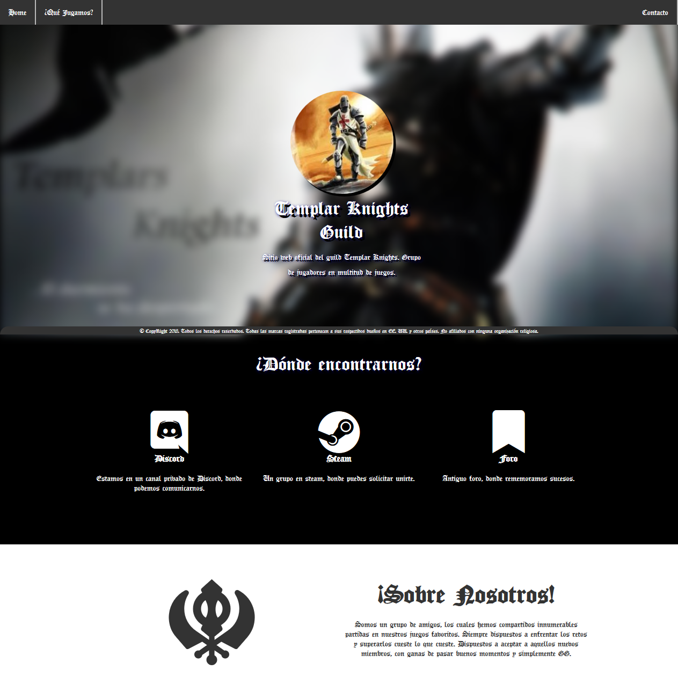

# Sitio Web Templar Knights Guild - Español

Este es un prototipo y diseño de una página web, para una guild de juegos.

Puede verse [Aquí](https://peterdamiang.github.io/TemplarKnightsGuild/).

## Screenshot

### Registro de cambios

_v 0.1:

* .- Muestra completa del prototipo.
* .- Lado del cliente responsivo.
* .- Uso de Font Awesome.

#### Licencia MIT
Copyright (c) 2018 Peter DG

Se concede permiso, libre de cargos, a cualquier persona que obtenga una copia de este software y de los archivos de documentación asociados (el "Software"), para utilizar el Software sin restricción, incluyendo sin limitación los derechos a usar, copiar, modificar, fusionar, publicar, distribuir, sublicenciar, y/o vender copias del Software, y a permitir a las personas a las que se les proporcione el Software a hacer lo mismo, sujeto a las siguientes condiciones:

El aviso de copyright anterior y este aviso de permiso se incluirán en todas las copias o partes sustanciales del Software.

EL SOFTWARE SE PROPORCIONA "TAL CUAL", SIN GARANTÍA DE NINGÚN TIPO, EXPRESA O IMPLÍCITA, INCLUYENDO PERO NO LIMITADA A GARANTÍAS DE COMERCIALIZACIÓN, IDONEIDAD PARA UN PROPÓSITO PARTICULAR Y NO INFRACCIÓN. EN NINGÚN CASO LOS AUTORES O PROPIETARIOS DE LOS DERECHOS DE AUTOR SERÁN RESPONSABLES DE NINGUNA RECLAMACIÓN, DAÑOS U OTRAS RESPONSABILIDADES, YA SEA EN UNA ACCIÓN DE CONTRATO, AGRAVIO O CUALQUIER OTRO MOTIVO, DERIVADAS DE, FUERA DE O EN CONEXIÓN CON EL SOFTWARE O SU USO U OTRO TIPO DE ACCIONES EN EL SOFTWARE. 

-------------------------------------------------------------------------------------------------------------
© CopyRight 2018. Todos los derechos reservados. Todas las marcas registradas pertenecen a sus respectivos dueños en EE. UU. y otros países. No afiliado con Valve Corp y/o BitSkins.

##### Comentarios finales

Este desarrollo son parte de mis practicas y hobbys, con mis amigos y conocidos, los cuales somos muy apasionados con los videojuegos. 
Parte del diseño de la web, pertenece al usuario [FaztWeb](https://github.com/FaztWeb/landing-page-three) y de la [W3](https://www.w3schools.com/).

Gracias.

_____________________________________________________________________________________________________________

# Web Site Templar Knights Guild - English

This is a prototype and design of a web page, for a guild games.

Can see [Aquí](https://peterdamiang.github.io/TemplarKnightsGuild/).

### ChageLogs

_v 0.1:

* .- Show the prototype.
* .- Client responsive.
* .- Font Awesome.

#### MIT license
Copyright (c) 2018 Peter DG

Permission is hereby granted, free of charge, to any person obtaining a copy of this software and associated documentation files (the "Software"), to deal in the Software without restriction, including without limitation the rights to use, copy, modify, merge, publish, distribute, sublicense, and/or sell copies of the Software, and to permit persons to whom the Software is furnished to do so, subject to the following conditions:

The above copyright notice and this permission notice shall be included in all copies or substantial portions of the Software.

THE SOFTWARE IS PROVIDED "AS IS", WITHOUT WARRANTY OF ANY KIND, EXPRESS OR IMPLIED, INCLUDING BUT NOT LIMITED TO THE WARRANTIES OF MERCHANTABILITY, FITNESS FOR A PARTICULAR PURPOSE AND NONINFRINGEMENT. IN NO EVENT SHALL THE AUTHORS OR COPYRIGHT HOLDERS BE LIABLE FOR ANY CLAIM, DAMAGES OR OTHER LIABILITY, WHETHER IN AN ACTION OF CONTRACT, TORT OR OTHERWISE, ARISING FROM, OUT OF OR IN CONNECTION WITH THE SOFTWARE OR THE USE OR OTHER DEALINGS IN THE SOFTWARE. 

-------------------------------------------------------------------------------------------------------------
© CopyRight 2018. All rights reserved. All trademarks belong to their respective owners in the USA. and other countries. Not affiliated with Valve Corp and BitSkins.

##### Comentarios finales

This is a practice with my friends, our are very passionate about videogames.
Design web source by [FaztWeb](https://github.com/FaztWeb/landing-page-three) and [W3](https://www.w3schools.com/).

Thanks you.
